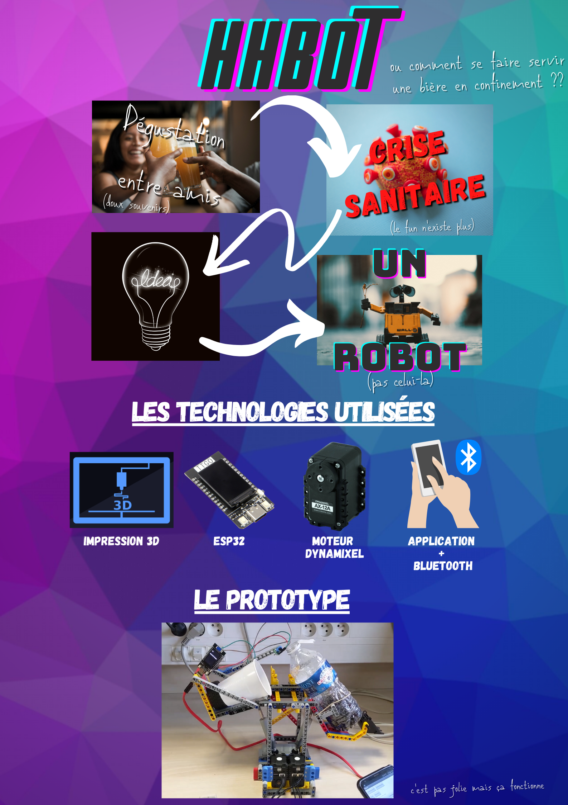

# HHBot

### Comment se faire servir une bière en confinement ? 

<figure class="video_container">
  <iframe src="https://www.youtube.com/embed/0xv8RzL4GvI" frameborder="0" allowfullscreen="true"> </iframe>
</figure>

<iframe width="560" height="315"
src="https://www.youtube.com/embed/MUQfKFzIOeU" 
frameborder="0" 
allow="accelerometer; autoplay; encrypted-media; gyroscope; picture-in-picture" 
allowfullscreen></iframe>

## Le projet
La problématique soulevée fut comment remplacer les événements festif présent à CPE Lyon en ses temps troublé.  
La solution été toute trouvée : un robot qui sert la bière moins mousseuse qu'au HH.  
Projet a était réaliser sur un sprint d'une semaine (environ 24 h de travail) dans le cadre du module de prototypage de CPE Lyon sous la direction de Sébastien Altounian. 
### Contraintes 
Les contraintes étaient l'utilisation des technologies suivantes :
- moteur de prototypage Dynamixel AX-12A
- Bluetooth Low Energy
- Conception assistée par ordinateur
- Impression 3D
- ESP32
  
### Collaborateurs :
- Thibault Leconte
- Edouard Mallecourt
- Hugo Grellier
  
## Instruction

1. Téléchargez IDE Arduino : https://www.arduino.cc/en/software
2. Suivez le tutoriel suivant pour rendre compatible avec L'ESP32 : https://randomnerdtutorials.com/installing-the-esp32-board-in-arduino-ide-windows-instructions/
3. Installez la bibliothèque VL53L0X et TFT-eSPI
4. Suivez le tutoriel suivant pour installer ros-serial: http://wiki.ros.org/rosserial_arduino/Tutorials/Arduino%20IDE%20Setup
5. Clonez du repo
6. Clonez des submodule:   <pre><code>git submodule init
git submodule update</code></pre>
7. Installez l'application smartphone via MIT App Inventor (Importer le fichier .aia)
8. Téléversez arduino sur la carte ESP32 ttgo
9. Lancez de ROS <pre><code>roslaunch motor_control controller_manager.launch</code></pre>
10. Connectez le smartphone en Bluetooth via l'appli à l'appareil HHBot3000
11. Appuyer sur "Launch beer"
12. Attendre un peu
13. Encore un tout petit peu..
14. 

